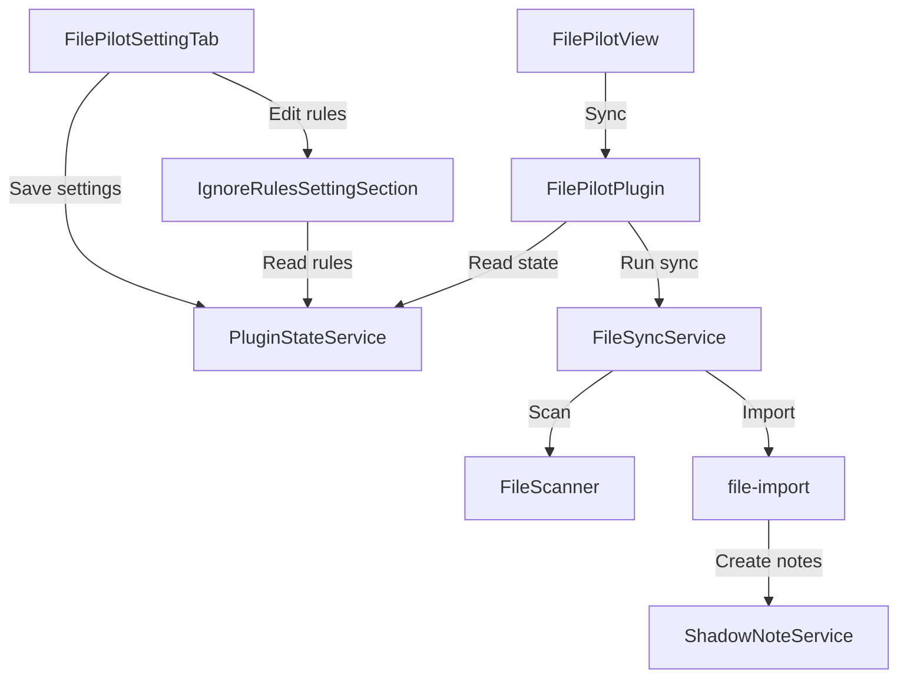

# File Pilot — C3 Component Diagram

```mermaid
flowchart TD
    View["FilePilotView"] -->|"Sync"| Main["FilePilotPlugin"]
    Settings["FilePilotSettingTab"] -->|"Save settings"| State["PluginStateService"]
    Settings -->|"Edit rules"| IgnoreSection["IgnoreRulesSettingSection"]
    IgnoreSection -->|"Read rules"| State
    Main -->|"Read state"| State
    Main -->|"Run sync"| Sync["FileSyncService"]
    Sync -->|"Scan"| Scanner["FileScanner"]
    Sync -->|"Import"| Import["file-import"]
    Import -->|"Create notes"| Shadow["ShadowNoteService"]
```
